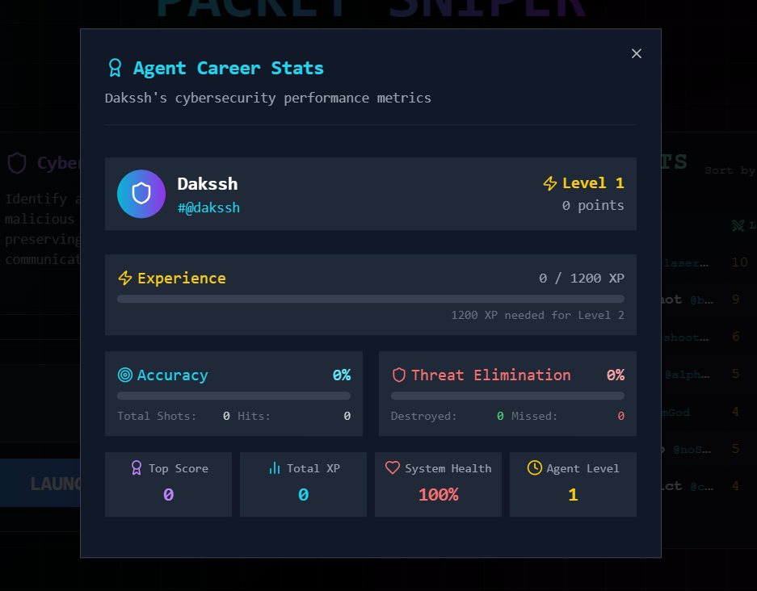
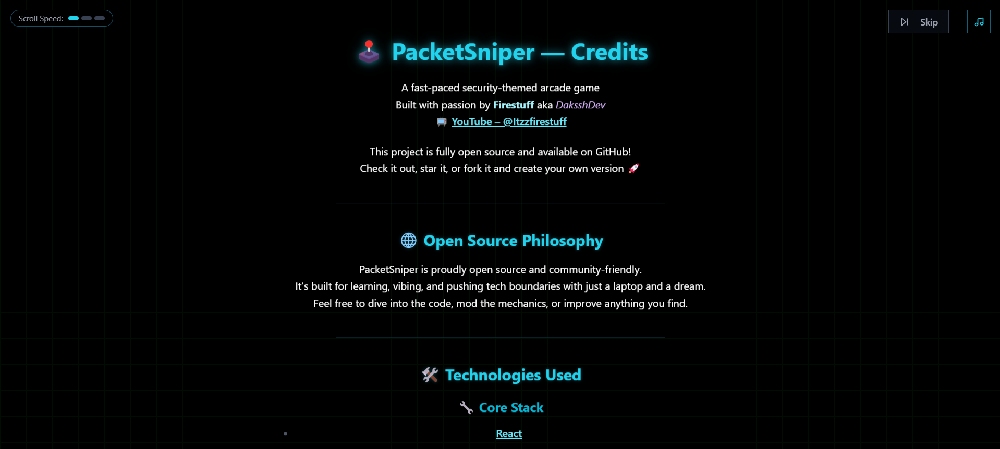

# 🎯 PACKET SNIPER 🎯

> **The sickest cybersecurity arcade game you never knew you needed fr fr**

Hey there, cyber defenders! 👋 Ready to stop some sus network traffic and become the ultimate packet sniper? This game is straight-up FIRE - built with React + Vite + Firebase and all the cool tech that keeps the vibes immaculate. 

No cap, this project slaps. It's giving cyberpunk aesthetics meets arcade-shooter energy meets network security simulation. 🔥


## 🎮 Gameplay - How It Works

Bro, the concept is simple but the execution is ELITE:

- 🖱️ **Point and Click** - Use your mouse to aim and shoot down malicious packets
- 🛡️ **Protect the Network** - Don't let bad packets through + don't shoot the good ones!
- 📊 **Level Up System** - Grind that XP, watch your level go brrrr, unlock new abilities
- 🏆 **Leaderboards** - Flex on your fellow hackers with your sick scores

The game gets progressively harder with each wave - more packets, faster movement, and trickier identification challenges. Different packet types have different visuals and behaviors. It's lowkey addicting.

## 🧠 Game Logic Breakdown

Here's how the game engine is cookin':

### 🎯 Core Mechanics
- **Packet Generation**: Random spawning of different packet types based on difficulty
- **Physics Engine**: Packets move with velocity + acceleration calculations
- **Collision Detection**: Pixel-perfect hit detection for your shots
- **Scoring System**: Points based on accuracy, speed, and packet type
- **Difficulty Scaling**: Wave-based progression with increasing challenge

### 🚀 Progression System
- **XP**: Gain experience points for successful hits
- **Leveling**: Unlock new abilities, backgrounds, and challenges
- **Special Effects**: Higher levels get wild visual effects (hyperspeed grid, etc.)

### 🔄 Game Loop
```
1. Wave starts → Packets spawn at random intervals
2. Player shoots → Hit detection calculated
3. Score updates → XP accrues
4. End-of-wave stats → Next wave begins with increased difficulty
5. Repeat until game over → Final score saved to leaderboard
```

## 🏗️ Project Structure

The codebase is organized like this (it's actually clean af):

```
📂 client/
  📂 public/
    📂 sounds/            # Game audio files
    📂 textures/          # Game textures
    📂 geometries/        # 3D model data
    📂 fonts/             # Custom fonts
    📂 favicon.ico        # Site icon
  📂 src/
    📂 components/
      📂 game/            # Game mechanics components
      📂 ui/              # Shadcn UI components & custom UI
      📂 AuthModal.tsx    # Login/register modal
      📂 Leaderboard.tsx  # Leaderboard component
    📂 lib/
      📂 stores/          # Zustand state stores
        📂 useAudio.tsx   # Audio state management
        📂 usePacketSniper.tsx  # Main game state
        📂 useGame.tsx    # Game control state
      📂 firebase.ts      # Firebase integration
      📂 sounds.ts        # Sound initialization
      📂 packetData.ts    # Packet types definitions
      📂 utils.ts         # Utility functions
    📂 pages/
      📂 Home.tsx         # Main menu & auth screen
      📂 Game.tsx         # Gameplay screen
      📂 Credits.tsx      # Credits screen with scroll effect
    📂 assets/            # Static assets (icons, images)
    📂 styles/            # Global styles and animations
    📂 App.tsx            # Main app component
    📂 index.css          # Global CSS
    📂 main.tsx           # Entry point
```

## 🎮 Game Showcase

Step into the neon-lit world of Packet Sniper with these game highlights!

> **Note:** The screenshots referenced below are placeholders. To add your own screenshots:
> 1. Create a `docs/screenshots` directory (already done for you)
> 2. Take screenshots of your game 
> 3. Name them `home.png`, `gameplay.png`, `stats.png`, `tutorial.png`, and `credits.png`
> 4. Place them in the `docs/screenshots` folder

### 🏠 Home Screen


The cyber-styled landing page features:
- User authentication with agent tag system
- Real-time leaderboard showing top players
- Dynamic background with grid effects
- Sound toggle and accessibility controls

### ⚔️ Gameplay Experience


The main arena where you'll defend the network:
- Fast-paced packet shooting mechanics
- Color-coded packet identification system
- Real-time scoring and combo system
- System health monitoring
- Wave progression indicators

### 📊 Career Stats



Track your progress with detailed stats:
- Level progression system
- Threat elimination metrics
- Accuracy calculations
- Comparison with previous sessions

### 🎓 Tutorial System


Learn the ropes with an intuitive tutorial:
- Step-by-step guidance
- Interactive examples
- Visual instruction
- Video demonstrations

### 🌟 Credits Screen



A cinematic scrolling experience:
- Star field background effects
- Adjustable scroll speed
- Tech stack showcase
- Easter eggs for the curious

## 🚀 Quick Start Guide

Get Packet Sniper up and running in minutes:

```bash
# Clone the repository
git clone https://github.com/yourusername/PacketSniper.git

# Navigate to the project directory
cd PacketSniper

# Install dependencies
npm install

# Start the development server
npm run dev
```

Then open http://localhost:5173 in your browser and start sniping those packets!

## 🔥 Tech Stack

This project leverages a powerful combination of modern technologies:

- ⚛️ **React 18** - UI components with Hooks and modern patterns
- 📘 **TypeScript** - Type-safe development experience
- 🚀 **Vite** - Lightning-fast development server and build tooling
- 🔥 **Firebase RTDB** - Real-time database for authentication and leaderboards
- 🎮 **Zustand** - Lightweight state management that just works
- 💅 **TailwindCSS** - Utility-first CSS framework
- 🎵 **Web Audio API** - Dynamic sound system with background music and effects
- 🧩 **Shadcn/UI** - Customizable component system

## 🔌 Firebase Integration Setup

The game uses Firebase for authentication and storing leaderboard data. Here's how to set it up:

1. Create a Firebase project at [firebase.google.com](https://firebase.google.com/)
2. Create a Realtime Database (RTDB)
3. Set up security rules for the database:

```
{
  "rules": {
    "users": {
      ".read": true,
      ".write": true
    },
    "leaderboard": {
      ".read": true,
      ".write": true
    }
  }
}
```

4. Get your Firebase config values from the Firebase console (Project Settings > General > Your Apps > Firebase SDK snippet > Config)
5. Create a `.env.local` file with your Firebase configuration values:

```
VITE_FIREBASE_API_KEY=your-api-key
VITE_FIREBASE_AUTH_DOMAIN=your-project-id.firebaseapp.com
VITE_FIREBASE_PROJECT_ID=your-project-id
VITE_FIREBASE_STORAGE_BUCKET=your-project-id.appspot.com
VITE_FIREBASE_MESSAGING_SENDER_ID=your-messaging-sender-id
VITE_FIREBASE_APP_ID=your-app-id
VITE_FIREBASE_DATABASE_URL=https://your-project-id-default-rtdb.firebaseio.com
```

## 💖 Contributing

Contributions are always welcome! Whether it's bug fixes, feature additions, or just improvements to the documentation.

1. Fork the repository
2. Create your feature branch (`git checkout -b feature/amazing-feature`)
3. Commit your changes (`git commit -m 'Add some amazing feature'`)
4. Push to the branch (`git push origin feature/amazing-feature`)
5. Open a Pull Request

## 📱 Contact & Community

- 🐦 Twitter: [@ItzzFirestuff](https://twitter.com/ItzzFirestuff)
- 📺 YouTube: [Itzzfirestuff](https://youtube.com/@Itzzfirestuff)
- 🌟 GitHub: [ItzzFirestuff](https://github.com/ItzzFirestuff)

## 🎨 Assets & Licensing

All assets, sounds, and images used in Packet Sniper are **free to use in your own projects**! Feel free to:
- Remix the pixel art
- Sample the sound effects
- Reuse UI components and animations

**Music:** All background music tracks are AI-generated, making them royalty-free and available for your own projects.

## 🔐 Authentication Notes

For simplicity, this project uses Firebase Realtime Database (RTDB) for authentication with the following approach:

- User credentials are stored in plain text to keep the authentication system simple
- This approach is not secure for production applications but works for this small project
- No sensitive user information is collected (just username, tag ID, and password)
- The simplified auth system made it faster to implement user accounts and leaderboard features

If you're adapting this code for a real-world application, you should implement proper authentication using Firebase Authentication or another secure solution.

## 💯 The Vibe Check

This project was built with chaotic good energy by [@ItzzFirestuff](https://twitter.com/ItzzFirestuff) - Check out more of my projects on my [YouTube channel](https://youtube.com/@Itzzfirestuff)!

Feel free to fork, star ⭐, or contribute to make this game even more lit! Let's see those PRs fr fr.

---

*Remember - in cybersecurity, accuracy > speed. But in this game... you need both to climb that leaderboard.* 😎